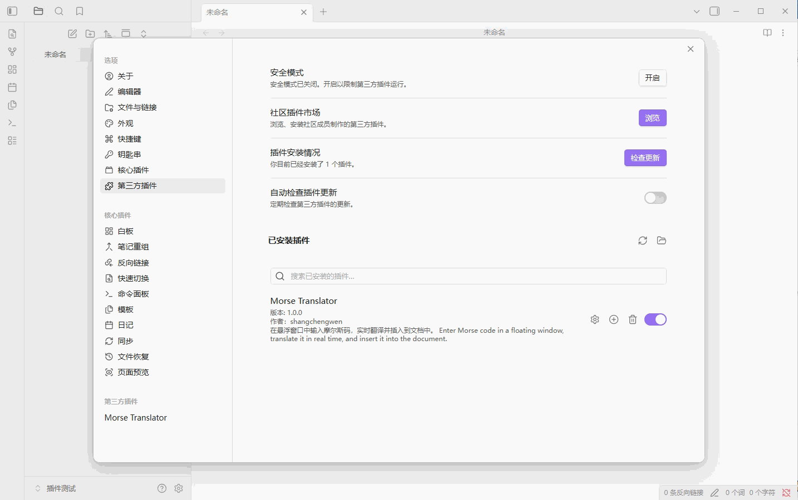

# 摩尔斯码翻译器 (Morse Translator) – Obsidian 插件

[English](#english) | [中文](#中文)

---

## 中文

### 简介

摩尔斯码翻译器是一个为 Obsidian 笔记应用开发的插件，允许您在悬浮窗口中输入摩尔斯码，并实时翻译成文本，直接插入到当前编辑的笔记中。

### 主要功能

- **悬浮窗口** – 可拖动的独立窗口，不干扰主界面操作
- **实时翻译** – 输入摩尔斯码时即时显示翻译预览
- **多种输入方式** – 支持空格分隔字母，斜杠 `/` 分隔单词
- **灵活插入** – 手动按 `Enter` 插入，或开启自动插入（停止输入后自动插入）
- **大小写控制** – 可选择输出大写或小写字母
- **自定义字符映射** – 支持自定义点（`.`）和横（`-`）的替代字符
- **多语言界面** – 支持中文和英文界面切换
- **命令支持** – 通过命令面板或快捷键打开/关闭翻译器

### 安装方法

#### 手动安装

1. 下载插件文件夹，放入 Obsidian 库目录下的 `.obsidian/plugins/` 文件夹中。
2. 在 Obsidian 中打开 `设置` → `第三方插件`，关闭安全模式。
3. 找到 `摩尔斯码翻译器` 并启用。

### 使用方法

1. **打开翻译器**
   - 命令面板中执行 `切换摩尔斯码翻译器` 或 `打开摩尔斯码翻译器`
   - 或在设置中开启 `自动打开`，启动 Obsidian 时自动打开

2. **输入摩尔斯码**
   - 字母之间用 **空格** 分隔
   - 单词之间用 **斜杠 /** 分隔
   - 示例：`.... . .-.. .-.. --- / .-- --- .-. .-.. -..` → `HELLO WORLD`

3. **插入文本**
   - 按 `Enter` 立即插入翻译结果
   - 或开启 `自动输入`，停止输入后自动插入（等待时间可调）

4. **其他操作**
   - 按 `Esc` 关闭窗口
   - 拖动标题栏可移动窗口位置
   - 点击 `设置选项` 展开/折叠更多控制项

### 自定义设置

| 设置项 | 说明 |
|--------|------|
| 自动打开 | 启动 Obsidian 时自动打开翻译器窗口 |
| 全局默认自动输入 | 新打开窗口时的默认自动输入状态 |
| 自动输入等待时间 | 停止输入后等待多少毫秒自动插入（300–5000ms） |
| 点字符集合 | 用于表示摩尔斯码中点的字符（如 `.`、`．`、`·`） |
| 横字符集合 | 用于表示摩尔斯码中横的字符（如 `-`、`—`、`－`） |
| 界面语言 | 选择中文或英文界面 |

### 快捷键支持

插件本身不预设快捷键，您可以在 Obsidian 的热键设置中为以下命令自定义快捷键：

- `切换摩尔斯码翻译器`
- `打开摩尔斯码翻译器`
- `关闭摩尔斯码翻译器`

### 注意事项

- 请确保文档处于 **编辑模式**（实时预览或源码模式），阅读模式下无法使用
- 输入的无效字符会以红色提示，不会影响翻译

### 开发信息

- 作者：shangchengwen
- 版本：1.0.0
- 开源协议：MIT

---

## English

### Introduction

Morse Translator is an Obsidian plugin that allows you to enter Morse code in a floating window, get real-time translation, and insert the decoded text directly into your current note.

### Features

- **Floating Window** – Draggable, non-intrusive window
- **Real-time Translation** – See translation preview as you type
- **Flexible Input** – Spaces separate letters, slashes `/` separate words
- **Flexible Insertion** – Manual `Enter` insertion or auto-insert after typing stops
- **Case Control** – Choose uppercase or lowercase output
- **Custom Character Mapping** – Define alternative characters for dots (`.`) and dashes (`-`)
- **Bilingual Interface** – Switch between Chinese and English
- **Command Support** – Open/close the translator via command palette or hotkeys

### Installation

#### Manual Installation

1. Download the plugin folder and place it in `.obsidian/plugins/` under your Obsidian vault.
2. Open `Settings` → `Third-party plugins` in Obsidian, turn off Safe Mode.
3. Find `Morse Translator` and enable it.

### Usage

1. **Open the Translator**
   - Run `Toggle Morse Translator` or `Open Morse Translator` from the command palette
   - Or enable `Auto Open` in settings to open when Obsidian starts

2. **Enter Morse Code**
   - Separate letters with **spaces**
   - Separate words with **slashes /**
   - Example: `.... . .-.. .-.. --- / .-- --- .-. .-.. -..` → `HELLO WORLD`

3. **Insert Text**
   - Press `Enter` to insert translation immediately
   - Or enable `Auto Insert` to insert automatically after you stop typing (delay adjustable)

4. **Other Actions**
   - Press `Esc` to close the window
   - Drag the title bar to move the window
   - Click `Settings` to expand/collapse more controls

### Settings

| Setting | Description |
|---------|-------------|
| Auto Open | Automatically open the translator window when Obsidian starts |
| Default Auto Insert | Default auto-insert state for new windows |
| Auto Insert Delay | Milliseconds to wait after typing stops before auto-inserting (300–5000ms) |
| Dot Characters | Characters representing dots in Morse code (e.g., `.`, `．`, `·`) |
| Dash Characters | Characters representing dashes in Morse code (e.g., `-`, `—`, `－`) |
| Interface Language | Select Chinese or English interface |

### Hotkeys

The plugin does not preset hotkeys. You can assign your own shortcuts in Obsidian's Hotkey settings for the following commands:

- `Toggle Morse Translator`
- `Open Morse Translator`
- `Close Morse Translator`

### Notes

- Make sure your document is in **Edit Mode** (Live Preview or Source mode). The translator cannot be used in Reading Mode.
- Invalid characters are highlighted in red and will not affect translation.

### Development Info

- Author: shangchengwen
- Version: 1.0.0
- License: MIT

---

## 反馈与贡献

如果您有任何问题或建议，欢迎通过 GitHub Issues 提交反馈。

For any questions or suggestions, please submit an issue on GitHub.
